<div align="center">
  <a href="https://github.com/App-Lab-Hub" target="_blank">
    
  </a>
  <h1>Formato</h1>
  <br>

Formato is an open-source, universal data converter designed for speed and privacy. Built as a modern desktop application, it leverages [Rust](https://www.rust-lang.org/) and [Tauri v2](https://github.com/tauri-apps/tauri) to deliver a smooth, cross-platform experience across macOS, Windows, and Linux. **100% local processing — no uploads, no limits.**

[](LICENSE)
[](https://tauri.app/)
[](https://www.rust-lang.org/)
[](https://svelte.dev/)
<br>
[](#)
[](#)
[](https://boosty.to/applabhub)

</div>

<p align="center">
  <a href="#features">Features</a> •
  <a href="#screenshots">Screenshots</a> •
  <a href="#supported-formats">Supported Formats</a> •
  <a href="#conversion-matrix">Conversion Matrix</a> •
  <a href="#installation">Installation</a> •
  <a href="#about-us">About Us</a> •
  <a href="#support">Support</a> •
  <a href="#getting-started">Getting Started</a> •
  <a href="#tech-stack">Tech Stack</a> •
  <a href="#license">License</a>
</p>

<div align="center">
  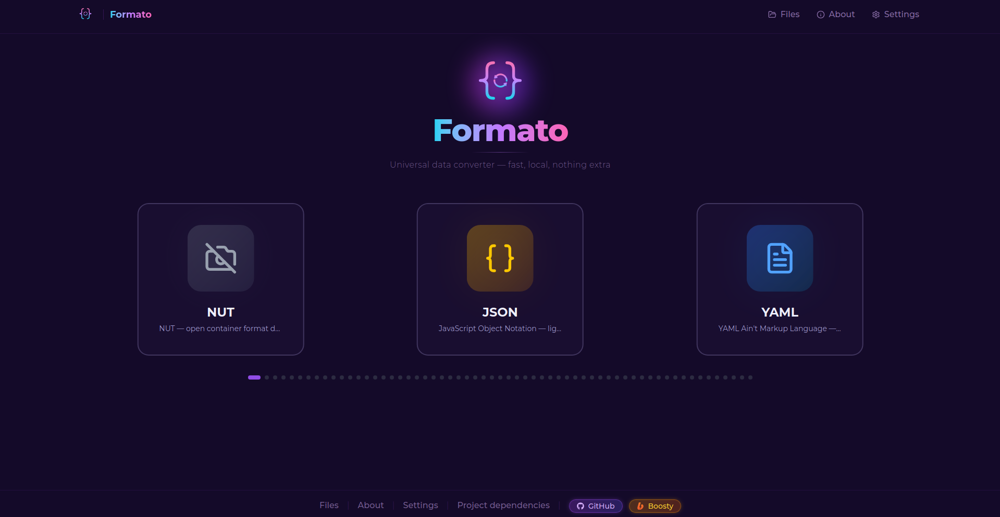
</div>

---

## Features

<div align="left">✅ Implemented</div>
<br>

| **Feature**                                | **Description**                                                                                                        | **Status** |
| ------------------------------------------ | ---------------------------------------------------------------------------------------------------------------------- | ---------- |
| **60+ Format Support**                     | Convert between 60+ formats, including JSON, YAML, XML, CSV, TOML, INI, Markdown, HTML, DOCX, ODT, XLSX, PDF, images, audio, and video. | ✅         |
| **Full Local Processing**                  | All data is processed on your device. Nothing is sent to the internet.                                                 | ✅         |
| **Speech Synthesis (TTS)**                 | Generate speech using built-in Russian and English models (Dmitry, Irina, Lessac, Amy).                                | ✅         |
| **Speech Recognition (STT)**               | Transcribe audio using Whisper models (Tiny, Base, Small, Medium, Large).                                             | ✅         |
| **Text, Document, Image, Audio & Video Conversion** | Seamlessly convert between different media types.                                                                     | ✅         |
| **File Archiving**                         | Pack converted files into ZIP, TAR.GZ, or TAR.XZ archives.                                                             | ✅         |
| **Conversion Caching**                     | Uses hash-based caching for lightning-fast repeated conversions.                                                       | ✅         |
| **Dark / Light / System Theme**            | Automatically follows your system theme, or switch manually in settings.                                              | ✅         |
| **RU / EN Interface**                      | Fully localized interface with instant language switching.                                                            | ✅         |
| **File Management**                        | Built-in file manager with history, search, and database reset options.                                               | ✅         |
| **Drag & Drop / Text Mode**                | Upload files via drag-and-drop or directly paste text for conversion.                                                 | ✅         |

---

## Screenshots

<div align="center">
  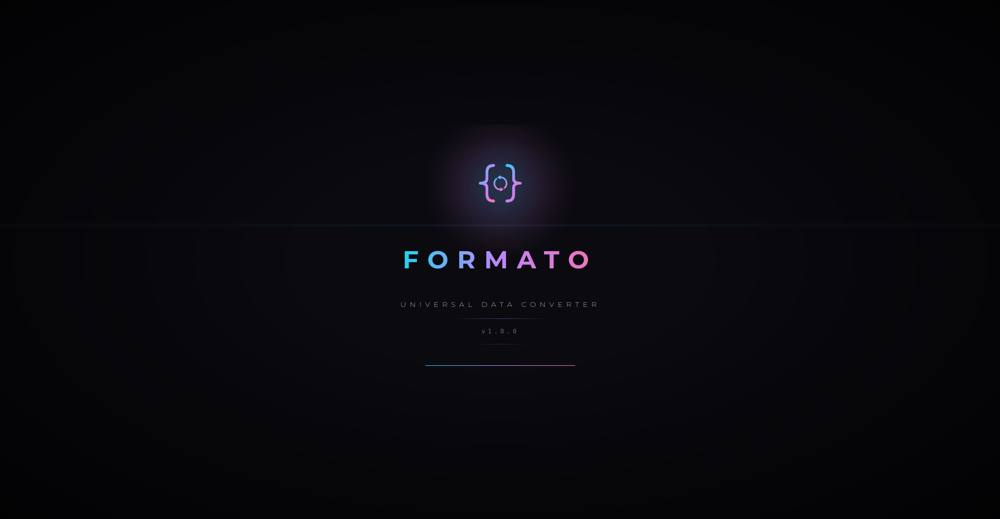
</div>

<br>

<div align="center">
  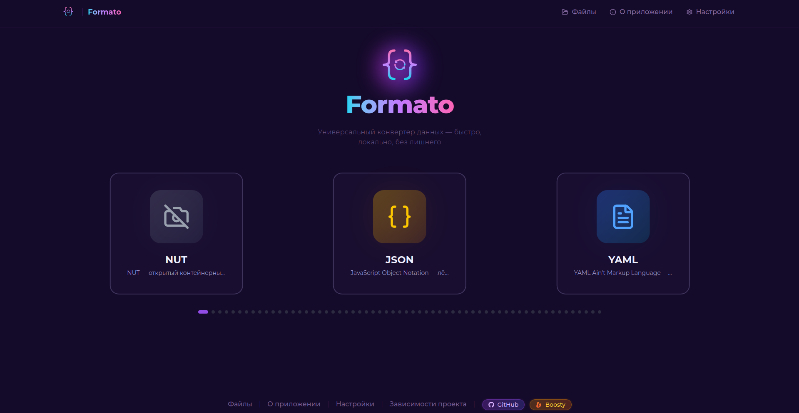
</div>

<br>

<div align="center">
  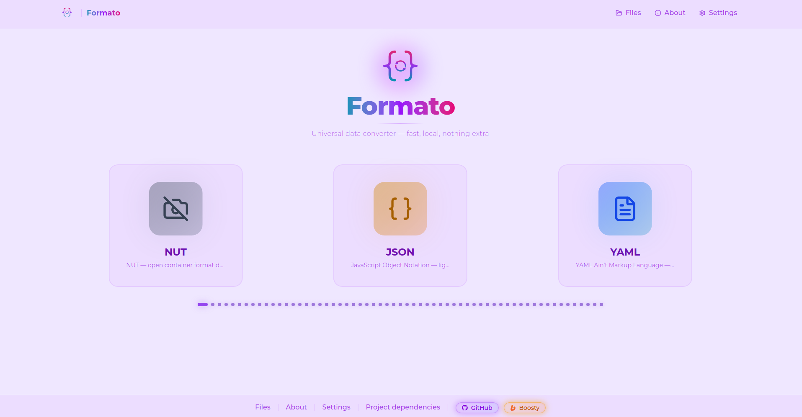
</div>

<br>

<div align="center">
  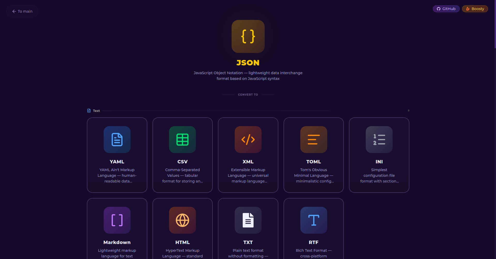
</div>

<br>

<div align="center">
  
</div>

<br>

<div align="center">
  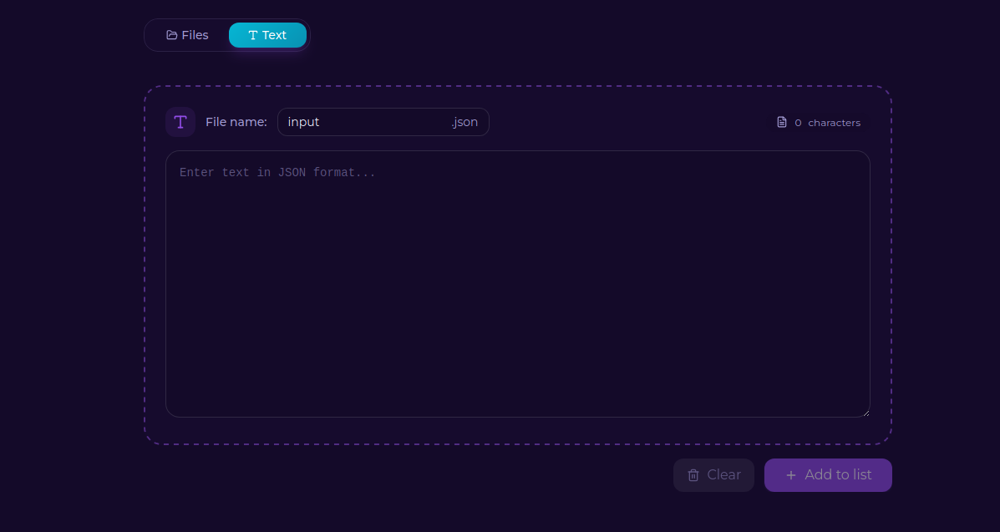
</div>

<br>

<div align="center">
  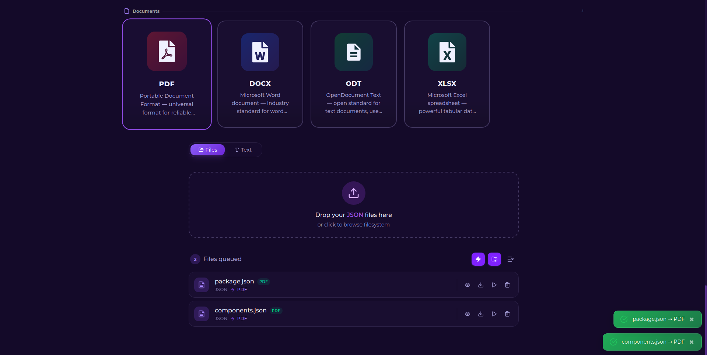
</div>

<br>

<div align="center">
  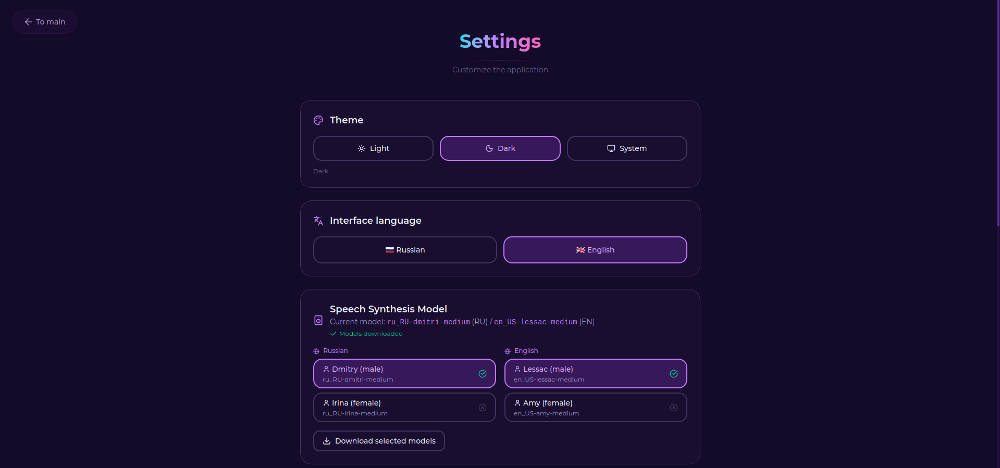
</div>

<br>

<div align="center">
  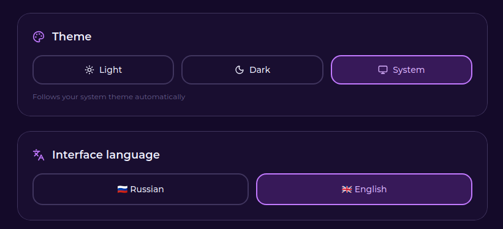
</div>

<br>

<div align="center">
  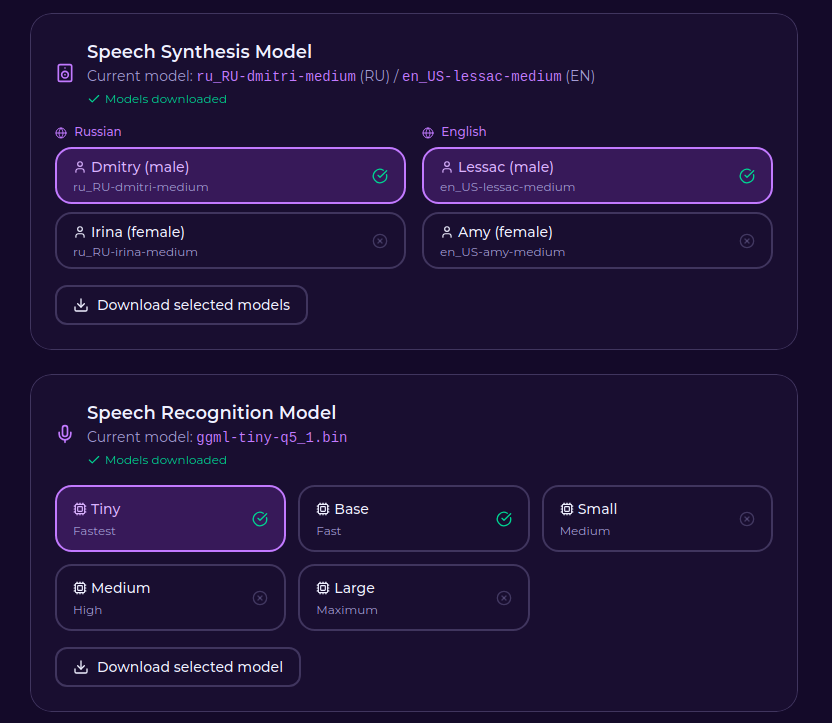
</div>

<br>

<div align="center">
  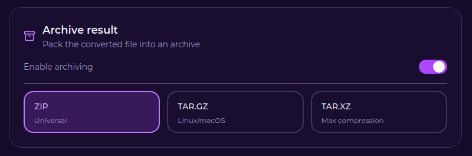
</div>

<br>

<div align="center">
  
</div>

<br>

<div align="center">
  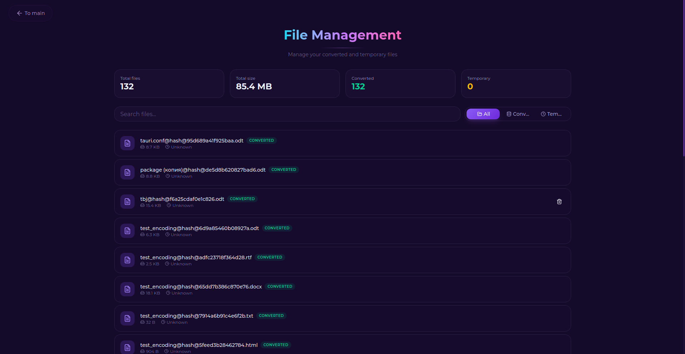
</div>

<br>

<div align="center">
  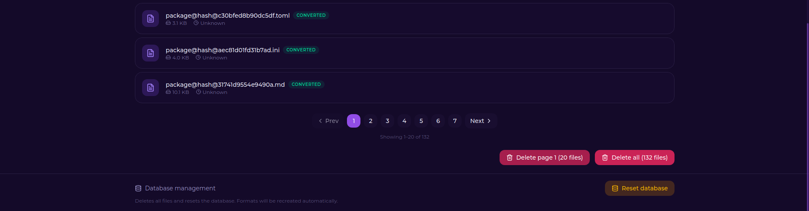
</div>

<br>

<div align="center">
  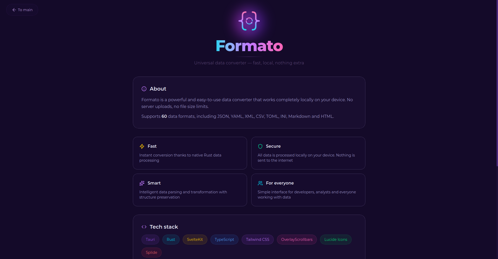
</div>

<br>

<div align="center">
  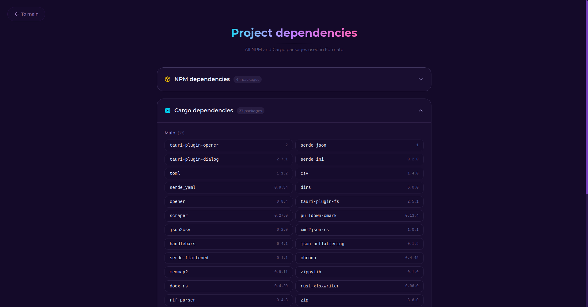
</div>


---

## Supported Formats

<div align="center">
  <table>
    <tr>
      <th>Category</th>
      <th>Formats</th>
    </tr>
    <tr>
      <td><b>Text & Config</b></td>
      <td><code>JSON</code> <code>YAML</code> <code>CSV</code> <code>XML</code> <code>TOML</code> <code>INI</code> <code>MD</code> <code>HTML</code> <code>TXT</code> <code>RTF</code></td>
    </tr>
    <tr>
      <td><b>Documents</b></td>
      <td><code>PDF</code> <code>DOCX</code> <code>ODT</code> <code>XLSX</code></td>
    </tr>
    <tr>
      <td><b>Images</b></td>
      <td><code>JPG</code> <code>JPEG</code> <code>PNG</code> <code>WEBP</code> <code>AVIF</code> <code>GIF</code> <code>BMP</code> <code>TIFF</code> <code>ICO</code> <code>QOI</code> <code>TGA</code> <code>EXR</code> <code>HDR</code> <code>PNM</code> <code>FF</code></td>
    </tr>
    <tr>
      <td><b>Audio</b></td>
      <td><code>MP3</code> <code>WAV</code> <code>AAC</code> <code>FLAC</code> <code>OGG</code> <code>OPUS</code> <code>WMA</code> <code>M4A</code> <code>AIFF</code> <code>AC3</code> <code>EAC3</code> <code>DTS</code> <code>TTA</code> <code>WV</code> <code>VOC</code> <code>ADX</code> <code>APTX</code> <code>SBC</code> <code>CAF</code> <code>W64</code></td>
    </tr>
    <tr>
      <td><b>Video</b></td>
      <td><code>MP4</code> <code>MOV</code> <code>AVI</code> <code>MKV</code> <code>WEBM</code> <code>WMV</code> <code>FLV</code> <code>3GP</code> <code>M4V</code> <code>TS</code> <code>VOB</code> <code>MPG</code> <code>MPEG</code> <code>NUT</code></td>
    </tr>
  </table>
</div>

---

## Conversion Matrix

Formato intelligently determines which conversions are possible based on the input type. Below is the availability logic:

| Input Type | To Text | To Image | To Audio | To Video | To Document |
| :--- | :---: | :---: | :---: | :---: | :---: |
| **Text** | ✅ | 🚫 | ✅ | 🚫 | ✅ |
| **Image** | ✅ | ✅ | 🚫 | 🚫 | ✅ |
| **Audio** | ✅ | 🚫 | ✅ | 🚫 | ✅ |
| **Video** | ✅ | 🚫 | ✅ | ✅ | ✅ |
| **Document** | ✅ | 🚫 | ✅ | 🚫 | ✅ |

> **Note:** Some specific conversions are blocked. For example, `PDF` cannot be converted directly to `DOCX`, `ODT`, or `XLSX`.

---

## Installation

### AppImage

Formato is available as an AppImage for Linux. Follow the guide below to install and launch it.

See the full guide: **[appimage.install.md](appimage.install.md)**

---

### Fedora (RPM)

If you are using Fedora, you can install Formato directly from the RPM package. See the full guide:

**[fedora.install.md](fedora.install.md)**

---

## About Us

Formato is developed by **[App Lab Hub](https://boosty.to/applabhub)** — a development collective crafting quality apps and tools with clean architecture. Explore our work and support us to keep our motivation alive for new projects.

---

## Support

If Formato has been useful to you, consider supporting our development. Your contribution helps us fix bugs faster, improve performance, and keep building great features.

<p align="center">
  <a href="https://boosty.to/applabhub" target="_blank">
    
  </a>
</p>

---

## Getting Started

### Prerequisites

- [Node.js](https://nodejs.org/) (v20+)
- [Rust](https://www.rust-lang.org/tools/install)
- [Tauri CLI](https://tauri.app/start/prerequisites/)

### Build from Source

```bash
# Clone the repository
git clone https://github.com/App-Lab-Hub/formato.git
cd formato

# Install dependencies
npm install

# Run in development mode (Vite)
npm run dev

# Run as a desktop app (Tauri)
npm run tauri dev

# Build the production app
npm run tauri build
```

---

## Tech Stack

- **Frontend:** [Svelte 5](https://svelte.dev/), [Tailwind CSS](https://tailwindcss.com/), [Splide](https://splidejs.com/), [Lucide Icons](https://lucide.dev/)
- **Backend:** [Rust](https://www.rust-lang.org/), [Tauri 2](https://tauri.app/)
- **Processing:** `Serde` (JSON/YAML), `csv`, `xml2json-rs`, `pulldown-cmark` (Markdown), `calamine` (Excel), `pdf-extract`
- **Media:** `ffmpeg-sidecar`, `whisper` (STT), Speech Synthesis (TTS)

---

## License

Formato is released under the [MIT License](LICENSE). See the [LICENSE](LICENSE) file for details.

---

### Third-Party Libraries

The following libraries and frameworks are used in this software:

- [Svelte](https://svelte.dev/), which is MIT licensed.
- [Tailwind CSS](https://tailwindcss.com/), which is MIT licensed.
- [Tauri](https://github.com/tauri-apps/tauri), which is MIT / Apache-2.0 licensed.
- [Serde](https://github.com/serde-rs/serde), which is MIT / Apache-2.0 licensed.
- [ffmpeg-sidecar](https://github.com/ffmpeg-sidecar/ffmpeg-sidecar), which is MIT licensed (uses FFmpeg compiled under LGPL/GPL).

---

### Fonts

The following fonts are utilized in this software, either bundled within the application or provided through web fonts:

[Montserrat Variable](https://fonts.google.com/specimen/Montserrat) — SIL Open Font License 1.1  
[Inter](https://fonts.google.com/specimen/Inter) — SIL Open Font License 1.1

---

<div align="center" style="color: gray;">
  Crafted with ❤️ by <a href="https://boosty.to/applabhub">App Lab Hub</a>
</div>
